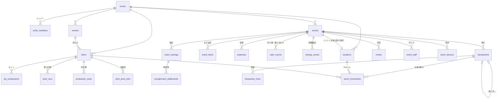

# 頒布物・在庫管理アプリ データベース設計

- 版: 1.0
- 作成日: 2026-10-07
- 対応する要件定義書: v1.1
- 実装: [schema.sql](schema.sql)(Supabase / PostgreSQL 15 以上)
- 検証: [test-schema.mjs](test-schema.mjs)(23項目。§9)

---

## 1. 設計の柱

| 方針 | 理由(要件) |
|---|---|
| **主キーは端末が発行するUUID**(v7推奨) | 電波のない会場で、2台が同時に記録しても衝突しない(F-1003、F-1006) |
| **販売・無償出庫・取り消し・在庫移動は追記だけの台帳** | 同期を「相手が持っていない行を送る」だけで済ませられる。取り消しも履歴に残る(F-404、F-205) |
| **在庫は在庫移動の合計で求め、残数を保存しない** | 残数を2台で書き換え合うと壊れる。移動の合計なら順番に関係なく同じ結果になる |
| **集計値(売上・残数・損益分岐)はビューで計算する** | 持ち主の付け替えや費用の修正が、過去の集計にもそのまま反映される(F-709、§6.6) |
| **マスタは後勝ち** | マスタを編集するのはサークル主だけなので、衝突はまれ(F-1004) |
| **全テーブルに circle_id を持たせる** | MVPではサークル1つだが、将来の配布でもデータ構造を変えずに済む |
| **金額は整数(円)** | 浮動小数点の誤差を出さない |

---

## 2. ER図



---

## 3. テーブル一覧

### 3.1 サークルと権限
| テーブル | 内容 | 種類 |
|---|---|---|
| `circles` | サークル | マスタ |
| `circle_members` | サークルのメンバーと役割(`owner` / `staff`) | マスタ |
| `invites` | 売り子の招待。QRコードのトークンはハッシュだけ保存する | マスタ |
| `event_staff` | 招待を受けた売り子。イベント単位で、期限つき | マスタ |
| `event_devices` | イベントに参加している端末と、最終同期時刻・未送信件数 | 端末が更新 |

### 3.2 頒布物
| テーブル | 内容 | 要件 |
|---|---|---|
| `owners` | 持ち主。「自分」は1サークルに1行(`is_self`)。受託元は受託手数料率を持つ | F-307、F-709 |
| `items` | 頒布物。種類(本 / グッズ / セット)、価格、印刷所の部数の刻み、残りわずかの基準 | F-101、F-106 |
| `set_components` | セットの構成品と数量 | F-104 |
| `print_runs` | 刷り記録(版、部数、印刷費) | F-102 |
| `production_costs` | 印刷費以外の制作費。作業時間は入れない | F-107 |
| `print_price_tiers` | 印刷所の価格表(部数 → 総額) | F-108 |
| `event_types` | イベント種別(大規模総合 / オンリーなど)。サークルごとに編集できる | §6.2 |

### 3.3 イベント
| テーブル | 内容 | 要件 |
|---|---|---|
| `events` | イベント | F-301 |
| `locations` | 在庫の置き場所。自宅・実家などに加え、**イベントごとに1行**作る | F-201 |
| `event_items` | そのイベントに出す品目、イベント限定価格、ボタンの並び順 | F-105、F-302、F-401 |
| `event_breaks` | 休憩・離席の時間帯 | F-411 |
| `expenses` | 経費(予定額と実額) | F-309 |

### 3.4 台帳(追記だけ)
| テーブル | 内容 |
|---|---|
| `transactions` | 取引。種類は `sale`(販売)/ `giveaway`(見本誌・献本・汚損・紛失)/ `void`(取り消し) |
| `transaction_lines` | 取引の明細。セットはセットの品目のまま、その時の単価と一緒に持つ |
| `stock_movements` | 在庫移動。在庫を変えるものはすべてここを通る |

### 3.5 終了処理
| テーブル | 内容 | 要件 |
|---|---|---|
| `cash_counts` | 金種別の枚数。`float`(開始時の釣り銭)と `close`(終了時の数え合わせ) | F-305、F-502 |
| `closing_counts` | 撤収時に数えた残数と、差異の扱い(販売を追加 / 紛失 / 持ち込み数を直す / そのまま) | F-501、F-406a |
| `event_closings` | 確定の記録。これがあるイベントには追記できない | F-506 |
| `consignment_settlements` | 受託分の精算書のスナップショット | F-504 |

---

## 4. 在庫の持ち方

在庫は「どこからどこへ何部動いたか」だけを記録し、場所ごとの在庫はその合計で求める(`v_stock`)。

| できごと | from | to | reason |
|---|---|---|---|
| 刷り上がって自宅に届く | なし | 自宅 | `print` |
| 印刷所から会場に直接届く | なし | イベント | `print` |
| 自宅からイベントに持ち込む | 自宅 | イベント | `transfer` |
| 受託品を預かる | なし | イベント | `consign_in` |
| 販売 | イベント | なし | `sale` |
| 見本誌・献本・汚損・紛失 | イベント | なし | `giveaway` |
| 残りを自宅に戻す | イベント | 自宅 | `transfer` |
| 受託品を返す | イベント | なし | `return_to_owner` |
| 持ち込み数の修正(F-406a) | 自宅 | イベント | `adjust` |
| 棚卸し・通販で減った分(F-204) | 自宅 | なし | `adjust` |

- **持ち込み数** = イベントの置き場所に入った数の合計
- **残数** = 入った数 − 出た数
- 残数は負になってよい(残数0での販売を許すため。F-406a)。その場合は終了処理で持ち込み数の修正を提案する
- **セットの販売**は、構成品ごとに在庫移動を1行ずつ書く。セットの構成を後で変えても、過去の在庫は変わらない
- **取り消した取引の在庫移動**は、ビュー `v_valid_movements` で除外する。取り消し用に逆向きの移動を書く必要はない

---

## 5. 取引と取り消し

```
transactions
  id = T1  type = sale   ← 販売
  id = T2  type = void   voids_txn_id = T1   ← T1 を取り消す
```

- 取り消しも1件の取引として追記する。元の取引は消えない(履歴で「取り消し済み」と表示できる)
- 1つの取引を取り消せるのは1回だけ(一意インデックス `transactions_one_void`)
- 取り消しの対象は、同じイベントの販売か無償出庫だけ(トリガー `check_void_target`)
- `zero_stock_override` で、残数0で記録したことを残す(F-406a)
- `paid_amount` は預かり金額。入力は任意で、将来の釣り銭の目安(F-306)の材料になる
- `recorded_at` は端末の時刻。時間帯別の集計と完売時刻に使う。サーバーが受け取った時刻は `received_at` に別に残す
- `source = closing` は、終了処理の「販売を追加」で作った取引

---

## 6. 同期

### 6.1 仕組み
- 各端末は IndexedDB に同じ構造のテーブルを持ち、**常に端末内のデータを正として動く**
- 全テーブルに `server_seq`(サーバーの通し番号)を持たせる。行を作ったり更新したりするたびに採番し直す
- 端末はテーブルごとに「最後に受け取った `server_seq`」を覚えておき、それより大きい行だけを取りに行く
- 送るときは:
  - **台帳**は `insert ... on conflict (id) do nothing`。同じ行を何度送っても1件のまま
  - **マスタ**は `upsert`。`client_updated_at` が古い更新はトリガーが捨てる(後勝ち)
- 通信できる間は Supabase Realtime で `event_id` ごとに購読し、数秒で他の端末に反映する

### 6.2 端末側の追加テーブル(IndexedDB のみ)
| テーブル | 内容 |
|---|---|
| `outbox` | まだ送っていない行(テーブル名、行、試行回数)。件数が「未送信 n件」になる |
| `sync_cursor` | テーブルごとの、最後に受け取った `server_seq` |
| `device` | この端末のID、ラベル、役割 |

### 6.3 ファイルでの取り込み(F-1006)
- 書き出し: そのイベントの `transactions`、`transaction_lines`、`stock_movements` のうち、その端末で作った行を JSON にする
- 取り込み: 主キーが同じ行は無視して追加する。2回取り込んでも重複しない
- 取り込んだ行は、取り込んだ端末の `outbox` にも入れる。どちらかの端末がつながれば、サーバーに届く

---

## 7. 権限(RLS)

| 対象 | サークル主 | 売り子(参加中のイベントだけ) |
|---|---|---|
| サークル・メンバー | 読む・書く | — |
| 品目・セット・持ち主 | 読む・書く | **そのイベントの品目だけ読む** |
| 刷り記録・制作費・価格表・経費 | 読む・書く | — |
| イベント・出す品目 | 読む・書く | 読む |
| 取引・明細・在庫移動 | 読む・**追記** | 読む・**販売と無償出庫と取り消しだけ追記** |
| 現金・残数確認・確定・精算書 | 読む・書く | — |
| 端末 | 読む・書く | 自分の端末の行だけ |

- 台帳は誰も更新・削除できない。RLSで更新の権限を与えておらず、さらにトリガーでも拒否する(管理者の操作でも止まる)
- 売り子は他人になりすまして書けない(`recorded_by = auth.uid()` を必須にしている)
- **確定後は売り子が追記できない**。サークル主だけが `is_correction = true` の訂正を追記できる(F-506)
- サークルの作成: `create_circle(id, 名前)` を呼ぶと、サークルを作って呼んだ人をサークル主にする。端末で先に作ったサークルを後から同期するため、同じ id で何度呼んでもよい
- 売り子の参加: 匿名ログイン → `redeem_invite(トークン)` を呼ぶと、そのイベントの `event_staff` に登録される。期限が切れるか、取り消されると見えなくなる(F-1005)

---

## 8. 集計ビュー

| ビュー | 内容 | 要件 |
|---|---|---|
| `v_active_transactions` | 取り消されていない取引 | 全般 |
| `v_valid_movements` | 有効な在庫移動 | 全般 |
| `v_stock` | 品目 × 置き場所の現在庫 | F-203 |
| `v_event_item_summary` | イベント × 品目の持ち込み・販売・無償出庫・残数・完売時刻 | F-405、F-501、F-702 |
| `v_sale_lines` | 販売明細。持ち主は**今の**持ち主で見る | F-707、F-709 |
| `v_event_owner_sales` | イベント × 持ち主の売上と受託手数料 | F-504、F-708 |
| `v_event_sales_by_slot` | 30分ごとの販売推移 | F-703、§6.1 |
| `v_event_cash` | 釣り銭準備金・売上・数えた額 | F-408、F-502 |
| `v_item_break_even` | 頒布物別の固定費・損益分岐部数・累計販売 | F-1101、F-1102 |

- ビューはすべて `security_invoker`。見る人の権限で動くので、売り子には自分のイベントの分だけが出る
- `v_item_break_even` は、セットで売れた分の売上を構成品の通常価格の比で按分する(§6.6)
- 刷り部数の目安(§6)とイベント別の損益分岐は、計算の途中経過を画面に見せる必要があるため、ビューの結果を使ってアプリ側で計算する

---

## 9. 検証

[test-schema.mjs](test-schema.mjs) で、スキーマをブラウザ用の PostgreSQL(PGlite)に流し、次の23項目を確かめた。すべて成功。

- サークル主がマスタ・在庫・招待を登録できる
- 招待を受ける前の売り子は品目を見られず、受けた後はそのイベントの品目だけ見られる
- 同じ取引を再送しても1件のまま
- 売り子は価格の変更・在庫の調整・現金の閲覧ができない
- 集計: セット販売の構成品への反映、取り消し分の除外、受託手数料、現金の理論残高、損益分岐(30,000円 ÷ 800円 = 38部)、自宅在庫
- 台帳は更新・削除できない(RLS とトリガーの両方)
- マスタの後勝ち、差分同期の番号
- 同じ取引の二重取り消しはできない
- 確定後は売り子が追記できず、サークル主の訂正だけ通る

実行方法(Node.js 20 以上):

```bash
npm i @electric-sql/pglite@0.2
```

```bash
node db/test-schema.mjs db/schema.sql
```

Supabase の `auth.uid()` と `authenticated` ロールは、テストの冒頭で代わりのものを作っている。

---

## 10. 注意点と今後

- **サークルの削除**: 台帳の削除をトリガーで禁止しているため、サークルを消すと連鎖削除が止まる。退会やデータ削除の機能を作るときは、管理用の関数でトリガーを一時的に外して消す
- **pgcrypto は使っていない**: 招待トークンのハッシュは標準の `sha256()` で計算する。Supabase で拡張機能のスキーマを気にしなくてよい
- **v1.1 の委託に出す機能**: `locations.kind = 'consignee'` を置き場所として使い、委託先からの報告用に `consignment_reports` テーブルを追加する。在庫移動の仕組みはそのまま使える
- **キャッシュレス対応**: `transactions` に `payment_method` 列を追加し、既存の行は現金とみなす
- **備品の按分(F-310)**: `equipment` テーブルと、イベントごとの使用記録を追加する
- **Supabase へ適用するとき**: `schema.sql` を最初のマイグレーションとして入れる。`authenticated` ロールへの権限付与は Supabase が既定で行う
